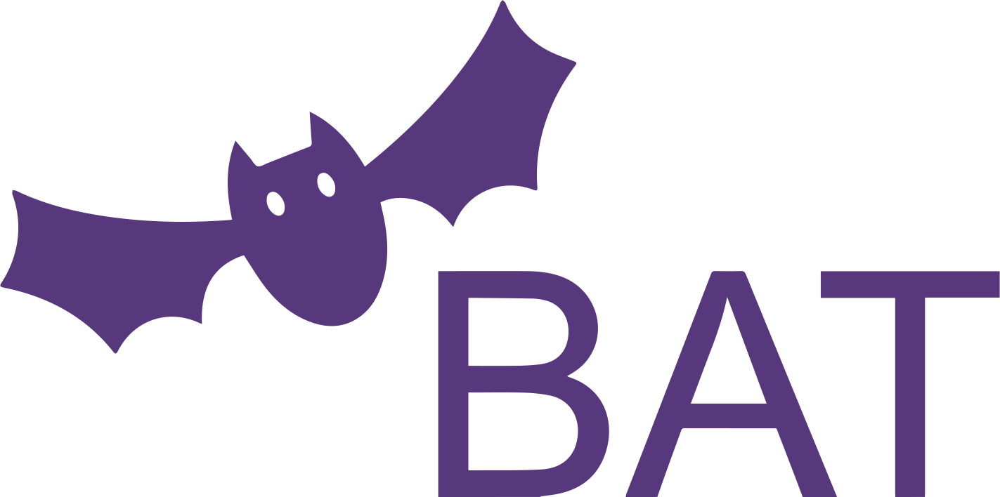

<h1 align="center">
	<br>
	<br>
	
	<br>
	<br>
	<br>
</h1>

> A standardized benchmark suite for auto-tuners

BAT is a standardized benchmark suite for auto-tuners that is based on benchmarks from [SHOC](https://github.com/Knutakir/shoc) and contains benchmarks for [CUDA](https://docs.nvidia.com/cuda/cuda-toolkit-release-notes/index.html) programs. The benchmarks are for both whole programs and kernel-code. BAT will save all your `JSON` and `CSV` results to an own results directory after auto-tuning is completed. Then it will parse specified files and print out the best parameters found by the auto-tuner. The parameters and other benchmarking information will be printed out prettified in the terminal.

This benchmark suite will be useful for you if you're making your own auto-tuner and want to use the benchmarks for testing or would like to compare your auto-tuner to other known auto-tuners. BAT can also be used to check how a parameter's value changes for different architectures.

## Prerequisites
- [Python 3](https://www.python.org/) (Or [Docker](https://www.docker.com/), see section <a href="#within-a-docker-container">Within a Docker container</a>)

## Set up auto-tuner benchmarks
Without using Docker, the following steps are required to download and install the auto-tuners:
- [OpenTuner](https://github.com/ingunnsund/opentuner)
    - Can be downloaded along other needed dependencies by calling `pip3 install -r requirements.txt` from the [tuning_examples/opentuner](tuning_examples/opentuner) directory.
- [Kernel Tuner](https://github.com/benvanwerkhoven/kernel_tuner)
    - Can be downloaded along other needed dependencies by calling `pip3 install -r requirements.txt` from the [tuning_examples/kernel_tuner](tuning_examples/kernel_tuner) directory.
- [CLTune](https://github.com/ingunnsund/CLTune)
    - Need to set the environment variable `KTT_PATH=/path/to/KTT` for using the benchmarks.
- [KTT](https://github.com/Fillo7/KTT)
    - Need to set the environment variable `CLTUNE_PATH=/path/to/CLTune` for using the benchmarks.

## Running benchmarks
```sh
# Run all benchmark for all auto-tuners
python3 main.py

# Run the `sort` benchmark for all auto-tuners
python3 main.py -b sort

# Run all benchmarks for auto-tuner `OpenTuner`
python3 main.py -a opentuner

# Run benchmark `scan` for auto-tuner `CLTune`
python3 main.py -b scan -a cltune
```

## Command-line arguments
### `--benchmark [name]`, `-b [name]`
Default: `none`

Benchmark to run. Example: `sort`. If no benchmark is selected, all benchmarks are ran for selected auto-tuner(s).

### `--auto-tuner [name]`, `-a [name]`
Default: `none`

Auto-tuner to run benchmarks for. Example: `ktt`. If no auto-tuner is selected, all auto-tuners are selected for benchmarking.

### `--verbose`, `-v`
Default: `false`

If all `stdout` and `stderr` should be printed out during building of the benchmark(s). By default it does not print out the information during the building.

### `--size [number]`, `-s [number]`
Default: `1`

Problem size for the data in the benchmarks. By default it uses a problem size of `1`. This is up to the specific auto-tuner to handle.

### `--technique [name]`, `-t [name]`
Default: `brute_force`

Tuning technique to use for benchmarking. If no technique is specified, the brute force technique is selected. This is up to the specific auto-tuner to handle.

## Add your own auto-tuner
It is easy to add new auto-tuner implementations for the benchmarks, just follow these steps:
1. Implement the benchmark(s) you want with your auto-tuner. If your auto-tuner tunes a whole program, the benchmarks can be found in [src/programs](src/programs). However if you have an auto-tuner that tunes kernels, the benchmarks can be found in [src/kernels](src/kernels), and you have to generate the input data. Generating of input data can be done like in the KTT examples found [here](tuning_examples/ktt).
2. Store your auto-tuner implementation of a benchmark inside a auto-tuner subdirectory in [tuning_examples](./tuning_examples). The path to the benchmark implementation should look similar to `./tuning_examples/kernel_tuner/sort/`.
2. Create a `config.json` file in the same directory as the auto-tuner with content similar to this:
```json
{
    "build": [
        "make clean",
        "make"
    ],
    "run": "./sort",
    "results": [
        "best-sort-results.json"
    ]
}
```

### Content of `config.json`
- `build`: A list of commands that will be ran before the `run` command. Note, it does not work correctly with `&&` between commands. This is because of a limitation in the package [subprocess](https://docs.python.org/3/library/subprocess.html) to run the commands in Python. A solution is therefore to split them in a list.
- `run`: The command to run the auto-tuning benchmark.
- `results`: A list of result files that contains the best parameters found in the auto-tuner benchmark. These will be printed out by BAT after the auto-tuning is completed.

## Within a Docker container
### Building
Here are some examples of how to build the different auto-tuner Docker images:
```sh
# Build OpenTuner Dockerfile
$ docker build -t bat-opentuner -f docker/opentuner.Dockerfile .

# Build Kernel Tuner Dockerfile
$ docker build -t bat-kernel_tuner -f docker/kernel_tuner.Dockerfile .

# Build CLTune Dockerfile
$ docker build -t bat-cltune -f docker/cltune.Dockerfile .

# Build KTT Dockerfile
$ docker build -t bat-ktt -f docker/ktt.Dockerfile .
```

### Running
Here are some examples of how to run the different auto-tuner Docker containers:
```sh
# Run the KTT container
$ docker run -ti --gpus all bat-ktt

# Example of running container detatched
$ docker run -d -ti --gpus all bat-ktt

# Open a shell into a detatched container
$ docker exec -it <container-id> sh

# After this the commands shown in the `Running benchmarks` section can be used
# Example:
$ main.py -b sort -a ktt -t mcmc -s 4
```
